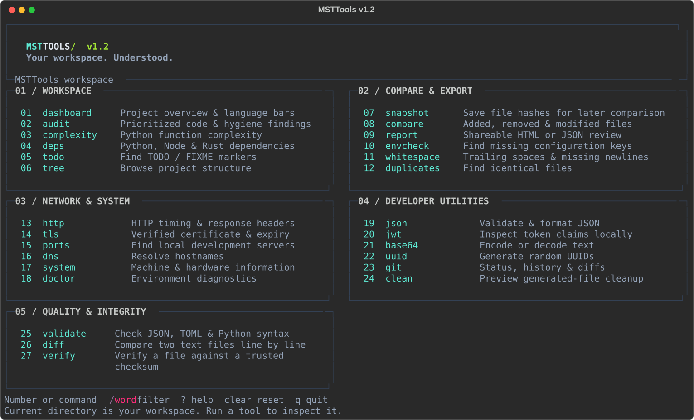

<div align="center">

# MSTTools

**Your workspace. Understood.**

A colorful command center for inspecting projects, diagnosing development environments,
and turning local findings into useful, shareable reports.


[Installation](#installation) · [Commands](#commands) · [Architecture](docs/architecture.md) · [Türkçe](README.tr.md)

</div>



## Why MSTTools?

You open an unfamiliar repository. What is inside? Where are the complex functions?
Which configuration keys are missing? What changed since your last working version?
MSTTools answers these questions in the terminal, without uploading your source code.

- **See the project:** language bars, file and line metrics, Git context, and project foundations.
- **Find the next useful action:** prioritized findings with exact file/line locations, Python complexity,
  potential credential patterns, TODOs, duplicates, and whitespace checks.
- **Compare before and after:** streaming SHA-256 snapshots detect content changes, even when file sizes match.
- **Share the review:** standalone, offline HTML reports and machine-readable JSON.
- **Stay in one terminal:** HTTP/TLS diagnostics, concurrent localhost port checks, JSON formatting,
  JWT decoding, Base64, UUIDs, Git tools, and preview-first cleanup.

## Installation

The package name is **msttool** and the command is **mst**. Python 3.9+ is required.
Install the published version once in your Python environment:

```console
python -m pip install --upgrade msttool
mst --version
```

Open your own project folder in a terminal, then run `mst`. The tool inspects that directory.
Use `mst -C` with a real directory path to select another workspace.
If the console command is not on PATH, use `python -m msttools`.

This GitHub release includes fixes packaged as **1.2.1**, while the terminal displays **MSTTools v1.2**.
To install from the extracted source folder instead:

```console
python -m pip install --upgrade .
```

Windows users can launch `Start-MSTTools.cmd` from the extracted folder after installation.

## The command center

Launch `mst` in an interactive terminal. Choose a number, type a command, or filter tools with `/network`.
Use `?` for the menu, `--help` for all commands, and `q` to exit. Bare `http`, `tls`, `dns`, `json`, and `compare`
commands prompt for required inputs. Full commands work too: `git log --limit 5`.
After a command finishes, press Enter to return to the menu. Direct commands such as `mst audit` do not pause.
Narrow terminals use a single-column layout. `NO_COLOR=1` and `--no-color` disable color.

## A practical workflow

```console
mst dashboard
mst audit
mst complexity --limit 10
mst envcheck --example .env.example --actual .env
mst snapshot -o .msttools/before.json
# Make your changes, then capture another snapshot:
mst snapshot -o .msttools/after.json
mst compare .msttools/before.json .msttools/after.json
mst report -o .msttools/review.html
```

Reports and snapshots do not overwrite files unless `--force` is given. `.msttools/` is excluded
from scans. Store both snapshots there; snapshots saved elsewhere may appear in later scans.

## Commands

| Command | Purpose | Example |
| --- | --- | --- |
| `dashboard` | Metrics, languages, findings | `mst dashboard --json` |
| `audit` | Local heuristics and CI thresholds | `mst audit --fail-on warning --json` |
| `complexity` | Rank Python functions by AST branch estimates | `mst complexity --limit 15` |
| `deps` | Python, Node and Rust dependency inventory | `mst deps --json` |
| `snapshot` | Save file paths, sizes and SHA-256 hashes | `mst snapshot -o .msttools/base.json` |
| `compare` | Added, removed and modified files | `mst compare before.json after.json --json` |
| `report` | Export a complete HTML or JSON review | `mst report -o review.html` |
| `envcheck` | Missing, extra and empty dotenv keys | `mst envcheck --example .env.example` |
| `whitespace` | Trailing whitespace and final newlines | `mst whitespace --json` |
| `http` | Status, time to headers, header presence | Enter your URL in the `http` menu prompt |
| `tls` | Validate certificate and show expiry | Enter your hostname in the `tls` menu prompt |
| `ports` | Concurrent localhost TCP checks | `mst ports --start 3000 --end 3010` |
| `json` | Strict JSON validation and formatting | `mst json data.json --sort-keys -o formatted.json` |
| `jwt` | Decode claims without verifying signatures | `mst jwt - --json` |
| `base64` | Encode/decode UTF-8 text | `mst base64 SGVsbG8= --decode` |
| `uuid` | Random version-4 UUIDs | `mst uuid --count 5` |
| `validate` | Validate JSON/TOML and Python syntax | `mst validate --json` |
| `diff` | Colored line-by-line text comparison | Select `diff` and supply two files |
| `verify` | Verify SHA-256/384/512 checksums | Select `verify` and supply the trusted digest |
| `clean` | Preview generated targets before deleting | `mst clean` |

Existing tools remain available: `system`, `summary`, `network`, `dev`, `doctor`, `security`, `disk`,
`uptime`, `env`, `inspect`, `stats`, `health`, `project`, `search`, `tree`, `duplicates`, `todo`, `large`,
`hash`, `process`, `ping`, `dns`, `serve`, `manifest`, `benchmark`, `git`, and `about`.
Run `mst COMMAND --help` for arguments. Example: `mst search TODO --extension py`.

`json`, `jwt`, and `base64` accept `-` for stdin. Use stdin for tokens to keep them out of shell history.
Decoded JWT payloads are intentionally printed; avoid sharing private claims.

## Configuration

Add an optional `.msttools.json` in the inspected project:

```json
{
  "ignore": ["vendor", "fixtures/generated", "*.min.js"],
  "max_file_bytes": 2000000,
  "complexity_threshold": 12
}
```

Patterns match project-relative paths or file/directory names using shell-style globs. This is **not**
a `.gitignore` parser: Git negation rules and nested `.gitignore` files are not supported.
Generated folders such as `.git`, `node_modules`, `.venv`, `build`, and `.msttools` are pruned.
Symlinks and Windows junctions are skipped. Binary, non-UTF-8 and oversized files count toward totals
but are not analyzed as text.

## Automation and exit codes

Structured output contains no logo or ANSI escapes. Errors go to stderr.

| Code | Meaning |
| --- | --- |
| `0` | Successful operation or checks within the selected threshold |
| `1` | Findings: audit threshold, snapshot differences, env/whitespace issues, HTTP 4xx/5xx, TLS expiry under 14 days |
| `2` | Invalid arguments, input, permissions, configuration or other operational error |
| `130` | Interrupted operation |

`audit` defaults to `--fail-on high`; use `none` for review-only runs. Legacy informational commands retain
their original presentation; reported errors return a nonzero status.

## Scope and privacy

Project analysis is local. No telemetry, API key, account, or hosted backend is required.
Network commands contact the requested destination; package installation uses your Python package index.
Reports omit source snippets, credential matches, environment values, and absolute workspace paths.
They still contain filenames and dependency names, so review them before sharing.

Score: start at 100; deduct 15 per high finding (cap 50), 3 per warning (cap 30), and 4 per info finding
(cap 20). It is **not** security certification or a measure of overall engineering quality.
Secret patterns can miss credentials or flag test data. Dependencies are direct declarations, not a
vulnerability scan or transitive resolution. Dotenv supports single-line `KEY=value`, not shell evaluation
or multiline values. TLS uses the system trust store; JWT decoding never establishes authenticity.

## Development

```console
python -m pip install -e ".[test]"
python -m unittest discover -s tests -v
python -m compileall -q msttools
```

Tests use temporary workspaces, a local Git repository, and local HTTP/TLS servers. No internet is required after test dependencies are installed.
GitHub Actions is configured for Windows, Ubuntu and macOS on Python 3.9, 3.12 and 3.13.
See [architecture](docs/architecture.md), [contributing](CONTRIBUTING.md), and [release notes](CHANGELOG.md).

Built by **MST TEAM**. Licensed under [MIT](LICENSE).

## Release 1.2

The menu no longer displays sample domains. New tools validate source/config syntax, compare real text files,
and verify file hashes. JSON formatting rejects duplicate keys and non-finite numbers. Git status preserves
unstaged changes. HTTP rejects malformed ports and control characters; ping rejects option-like hosts.

`validate` returns 1 for invalid or skipped files and 2 for unreadable files. It checks syntax, not program
behavior or schemas. `diff` returns 1 for different text; it displays source content, so inspect results before
sharing them. `verify` returns 1 for a digest mismatch and 2 for malformed input. A digest is only as trustworthy
as the source from which you obtained it. HTTP/TLS failures can indicate the destination or network, not a tool bug.
